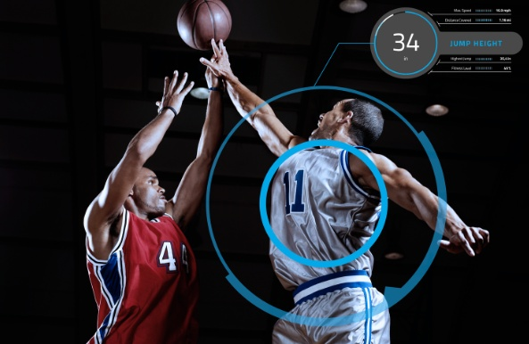

# Basketball UWB/LPS+IMU Tracking Stack

An engineering tracking stack that models a layered indoor basketball positioning system using UWB/LPS with optional IMU fusion.



This repository is not a production system and not a commercial RTLS implementation.
It is a structured, readable reference that shows how the layers of a real tracking system fit together.

---

### The repository implements:

* Anchor-based indoor positioning concepts (TDoA-ready architecture)
* Time alignment and synchronization assumptions
* Multilateration basics
* Measurement quality handling
* Kalman-based state estimation
* Optional IMM extension
* Streaming pipeline structure
* Replay/debug-friendly output

---

## Architecture and hardware
* [ARCHITECTURE.md](docs/ARCHITECTURE.md)
* [HARDWARE.md](docs/HARDWARE.md)

---

## Project Structure documentation

* [tracking_mvp/README.md](tracking_mvp/README.md) — explanation of the service internals
* [tracking_mvp/filters/README.md](tracking_mvp/filters/README.md) — tutorial of the RTLS pipeline (TDoA, multilateration, filtering)

---

## Supported Modes

### LPS-only

Position-based tracking with derived speed and acceleration.

### IMU-only

Movement and load metrics without absolute court positioning.

### LPS + IMU Fusion

Smoother trajectories and better short-term stability.

---

## Running the code

LPS simulation mode:

```bash
python -m tracking_mvp --mode lps
```

TDoA demonstration mode:

```bash
python -m tracking_mvp --mode tdoa
```


